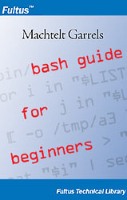

# 新版本和取得方法

最新版本可以在 [http://tille.xalasys.com/training/bash/](http://tille.xalasys.com/training/bash/) 找到。你也可以在 [http://tldp.org/LDP/Bash-Beginners-Guide/html/index.html](http://tldp.org/LDP/Bash-Beginners-Guide/html/index.html) 找到相同的版本。

[Fultus.com](http://store.fultus.com/product_info.php?products_id=66) 已经有印刷版本。 

## 图1. 封面

封面，红色高亮代码配以蓝色背景。
