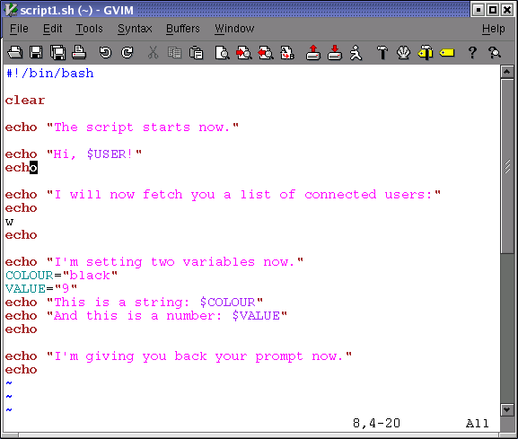

# 建立并且运行一个脚本

## 编写与命名

一个shell脚本是你重复使用的命令序列。这个序列通常是通过在命令行输入整个脚本的命令来执行的。或者，你可以使用cron工具来使脚本自动执行任务。脚本的另外一个用法是在UNIX的启动和关闭过程中定义在init脚本中的守护程序和服务的操作。

要建立一个shell脚本，在你的编辑器中打开一个新的空白文件。任何文本编辑器就可以：`vim`，`emacs`，`gedit`，`dtpad`都可以。可能你会选择一个高级的编辑器比如 `vim` 或者 `emacs`，因为它们可以设置来高亮语法来帮助初学者避免很多经常犯的错误，比如忘记括号和冒号。

把UNIX命令放在一个新的空白文件里，就象在命令行输入命令。就像先前的讨论（参阅[第 1.3 节 “执行命令”](../Bash-And-Bash-Script/Executing-Commands.md)），命令可以作为shell函数，shell组成部分，UNIX命令和其他脚本。

为你的脚本起一个合理的名字来提醒自己脚本的作用。确定你的脚本的名字和已经存在的命令是没有冲突的。为了保证不会引起混乱，脚本名字经常以`.sh`结尾；尽管如此，还是有可能你选择的脚本名字已经和系统中原来的是相同的。使用`which`，`whereis`和一些其他命令来查找程序的文件的信息：

```bash
which -a script_name
whereis script_name
locate script_name
```

## script1.sh

在本例子中我们使用bash内建命令 `echo` 在此任务运行建立输出之前来通知用户将发生什么。强烈建议告知用户脚本的用途，_因为本脚本什么事都不干_防止用户变得过于紧张。我们会在第 8 章 编写交互脚本[第 8 章 _编写交互脚本_](../Writing-Interactive-Script/README.md)第八章继续如何通知用户。 

### 图 2.1. script1.sh



正好自己写一下脚本。建立一个目录 `~/scripts` 来存放你的脚本将会是个好主意。把此目录添加到 `PATH` 变量中： 

```bash
export PATH="$PATH:~/scripts"
```

如果你才开始使用Bash，最好使用一个给不同结构以不同颜色的文本编辑器。`vim`，`gvim`，`(x)emacs`，`kwrite`和许多其他支持语法高亮的编辑器；详细请察看编辑器的文档。 

**^^^注意^^^ 不同的提示符**

本教程的提示符的改变都依赖作者的心情。相对于标准的`$`提示符他更接近之际情况。唯一的约定就是，_root_提示符以`#`结尾。 

## 执行脚本

为了能使当前用户运行脚本，它应该有可执行权限。在设置权限时，检查你是否得到你想要得权限。完成后脚本就可以象其他命令一样运行： 

```bash
chmod u+x script1.sh

ls -l script1.sh
###-rwxrw-r--    1 willy	willy		456 Dec 24 17:11 script1.sh

script1.sh
###The script starts now.
###Hi, willy!
###
###I will now fetch you a list of connected users:
###
###  3:38pm  up 18 days,  5:37,  4 users,  load average: 0.12, 0.22, 0.15
###USER     TTY      FROM              LOGIN@   IDLE   JCPU   PCPU  WHAT
###root     tty2     -                Sat 2pm  4:25m  0.24s  0.05s  -bash
###willy	 :0       -                Sat 2pm   ?     0.00s   ?     -
###willy    pts/3    -                Sat 2pm  3:33m 36.39s 36.39s  BitchX willy ir
###willy    pts/2    -                Sat 2pm  3:33m  0.13s  0.06s  /usr/bin/screen
###
###I'm setting two variables now.
###This is a string: black
###And this is a number: 9
###
###I'm giving you back your prompt now.

echo $COLOUR

echo $VALUE
```

这是执行脚本最普通的方法。在子shell中一般都是这么执行脚本。建立在子shell中的变量，函数和别名等只有子shell使用。当那个shell退出，父shell重新得到控制的时候，所有的东西都被清空，脚本对shell状态所作的改变耶全部清除。

如果你没有把 `scripts` 的目录放到`PATH`里面，当前目录也不在`PATH`变量中，那么你可以这样来执行脚本： 

```bash
./script_name.sh
```

脚本也可以被明确地指定shell执行，不过通常我们只有在想得到特殊的行为时候才这样做，比如脚本是否能在另外一个shell里面工作或者打印调试的信息：

```bash
rbash script_name.sh
sh script_name.sh
bash -x script_name.sh
```

特定的shell会成为当前shell子shell来运行脚本。当你想以特殊的选项或者以脚本没有指定的特殊条件来启动脚本时候可以这么做。

如果你想在当前脚本执行脚本而不想启动一个新的shell，你可以使用`source`：

```bash
source script_name.sh
```

**iii提示iii source = .**

Bash内建命令 `source` 是和Bourne shell的 `.` (dot) 命令具有相同含义 

这里脚本不需要可执行权限。命令在当前shell力执行，所以任何对环境的改变，将在脚本结束时同样起作用：

```bash
source script1.sh
###--output ommitted--

echo $VALUE
###9
```
